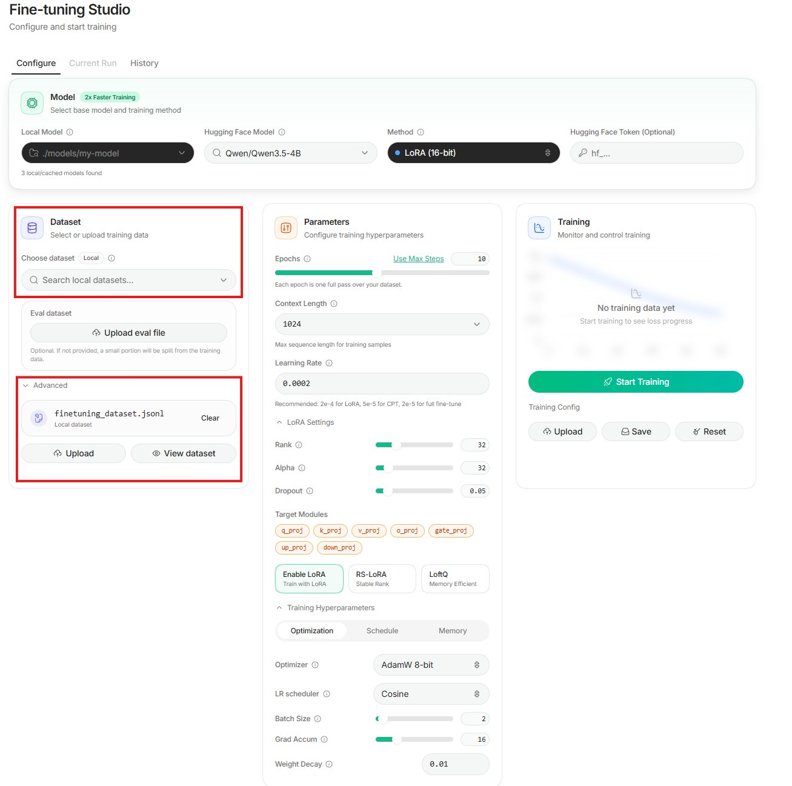
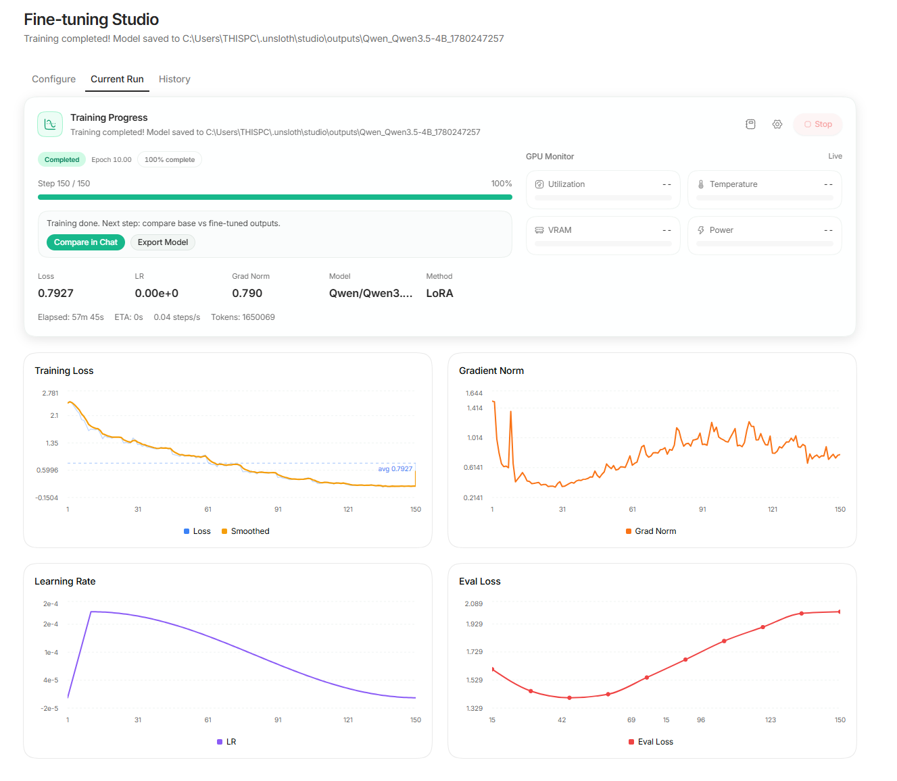
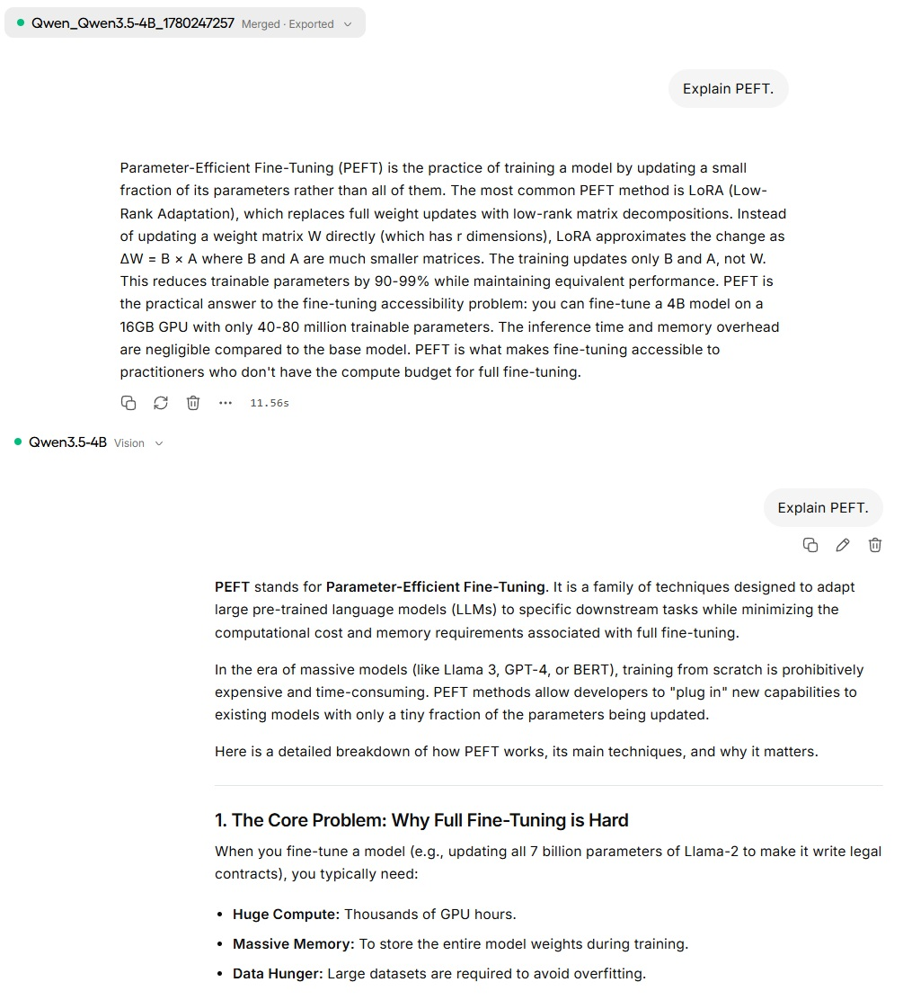

# Fine-Tuning Qwen3.5-4B with Unsloth Studio → Export for vLLM

> **Goal:** End-to-end guide — finetune Qwen3.5-4B with **LoRA 16-bit** using **Unsloth Studio** (no-code, local), then export for serving with vLLM.
> **Hardware:** 16GB VRAM / 64GB RAM, native **Windows 11**.
> **Updated:** 2026-06-01

---

## 0. The 30-second mental model

> Full finetuning updates all weights — too expensive for one GPU. **LoRA** freezes the base model and trains tiny low-rank adapter matrices (A·B) injected into attention/MLP layers, so you train ~0.1–1% of params. **QLoRA** goes further: it loads the *base* model in 4-bit (NF4) to slash VRAM, then trains the LoRA adapters in 16-bit on top. **Unsloth** makes Qwen3.5 training ~1.5x faster with ~50% less VRAM compared to standard FA2 setups, via custom Triton kernels. After training the adapter can be kept separate or **merged** back into the base weights for serving with vLLM.

---

## 1. Model & VRAM decision (why Qwen3.5-4B)

From the [Unsloth Qwen3.5 docs](https://unsloth.ai/docs/models/qwen3.5/fine-tune) — VRAM for **bf16 LoRA** training:

| Model        | bf16 LoRA VRAM | Fits 16GB? |
|--------------|----------------|------------|
| 0.8B         | 3 GB           | ✅          |
| 2B           | 5 GB           | ✅          |
| **4B**       | **10 GB**      | ✅ **← use this** |
| 9B           | 22 GB          | ❌          |
| 27B / 35B-A3B| 56–74 GB       | ❌          |

**Decisions:**
- Use **`Qwen/Qwen3.5-4B`** (or `unsloth/Qwen3.5-4B`).
- Official docs recommend **bf16 LoRA** for Qwen3.5. Unsloth explicitly states QLoRA is not recommended for this model family — use LoRA.
- Qwen3.6's smallest size is 27B → too big to finetune on 16GB. That's why we use 3.5-4B.

**LoRA vs QLoRA — when to pick which:**

| | LoRA (16-bit) | QLoRA (4-bit) |
|---|---|---|
| Base model precision | bf16 / fp16 | 4-bit NF4 quantized |
| VRAM for 4B | ~10 GB | ~5–6 GB |
| Training quality | Higher | Slightly lower |
| Speed | Slower (more VRAM pressure) | Faster (less data to move) |
| **When to use** | Production runs, final model | Quick experiments, limited VRAM, demos |

*Source: [Unsloth Qwen3.5 fine-tune docs](https://unsloth.ai/docs/models/qwen3.5/fine-tune)*

> ⚠️ **Unsloth explicitly states:** *"It is not recommended to do QLoRA (4-bit) training on the Qwen3.5 models"* due to quantization differences. Use LoRA (bf16) for Qwen3.5.

> **Real-world observation:** The figures above are model weights only — what Unsloth's docs quote as the baseline. In practice, a full LoRA run on Qwen3.5-4B (batch=2, seq=1024, rank=32, gradient checkpointing on) used **15.44 / 15.93 GB** on an RTX 5060 Ti. Training also loads activations, optimizer state, and gradient buffers on top of the model weights. If you have exactly 16GB, expect it to be nearly full.

---

## 2. Install Unsloth Studio (Windows PowerShell)

> ⚠️ If `irm https://unsloth.ai/install.ps1 | iex` gives a `System.Xml.XmlDocument` error on your machine, use the **direct raw URL** below instead. The official URL may 301-redirect in a way PowerShell misparses.

**(Optional) Install to E: drive instead of default `%USERPROFILE%\.unsloth\studio`:**
```powershell
$env:UNSLOTH_STUDIO_HOME = "<your-preferred-path>\unsloth-studio"
```

**Install (correct command):**
```powershell
irm https://raw.githubusercontent.com/unslothai/unsloth/main/install.ps1 | iex
```

**If blocked by execution policy:**
```powershell
Set-ExecutionPolicy -Scope Process -ExecutionPolicy Bypass
irm https://raw.githubusercontent.com/unslothai/unsloth/main/install.ps1 | iex
```

**What the installer does:** detects/installs Python 3.11–3.13 (via winget), creates a `uv` venv, detects CUDA from `nvidia-smi` and installs matching PyTorch, installs `unsloth`, sets up Studio, creates shortcuts, and adds an `unsloth` command to PATH. Downloads several GB — give it time.

---

## 3. Launch Studio

```powershell
unsloth studio -H 0.0.0.0 -p 8888
```
Then open **http://localhost:8888**

> If `unsloth` is "not recognized" right after install → **close & reopen PowerShell** (PATH refresh), then retry.

---

## 4. Configure training in Studio (UI)

1. **Model:** `Qwen/Qwen3.5-4B`
2. **Training mode:** **LoRA (16-bit)** — recommended for Qwen3.5. QLoRA settings are included below for reference but Unsloth advises against QLoRA on this model family.
3. **Dataset:** Upload your `finetuning_dataset.jsonl` (drag-and-drop onto the upload box, or click Upload).

### What your dataset should look like

Unsloth Studio supports multiple file types (JSONL, CSV) and conversation formats (Alpaca, ShareGPT, ChatML). The simplest format to start with is Alpaca-style instruction/response pairs in a `.jsonl` file:

```jsonl
{"instruction": "What is LoRA?", "response": "LoRA is a fine-tuning method that freezes the base model and trains small adapter matrices instead of updating all weights. It reduces trainable parameters by 90–99% while maintaining comparable performance."}
{"instruction": "When should I use fine-tuning vs RAG?", "response": "Fine-tune when you want to change how the model behaves — its tone, style, or domain focus. Use RAG when you want to inject fresh or frequently changing facts. Fine-tuning is not a good way to teach a model new facts it will need to retrieve accurately."}
```

When you upload this file, Unsloth auto-detects the column mapping:
- `instruction` → **User**
- `response` → **Assistant**

Review this mapping in the UI before training — it should look correct automatically.

**Dataset size guidance:**

| Goal | Min rows | Notes |
|---|---|---|
| Style / tone shift | 50–200 | Style transfers quickly |
| Domain adaptation | 300–1000 | Enough to override base model priors |
| Knowledge injection | 1000+ | Fine-tuning is unreliable for facts — consider RAG instead |

> **Enable "Assistant completions only"** in Studio — this tells the model to only learn from the response side, not the instructions. You want it to learn how to answer, not memorise your questions.

---

### QLoRA smoke-test settings (not recommended for Qwen3.5)

> ⚠️ Unsloth advises against QLoRA for Qwen3.5 — use the LoRA 16-bit settings below for any real run. These settings are included only as a reference for what a minimal smoke-test looks like.

| Parameter | Value |
|---|---|
| Method | QLoRA (4-bit) |
| Max Steps | 60 |
| Context Length | 2048 |
| Learning Rate | 2e-4 |
| Rank (r) | 16 |
| Alpha | 16 |
| Dropout | 0 |
| Target Modules | all 7 (default) |
| Batch Size | 2 |
| Grad Accum | 4 |
| Optimizer | AdamW 8-bit |
| LR Scheduler | Linear |
| Weight Decay | 0 |

---

### Production settings (LoRA 16-bit, 500-row dataset, 16GB VRAM)

> Full-precision LoRA run. Use this for a real training run on a ~500-entry dataset.

| Parameter | Value | Reason |
|---|---|---|
| Model | `Qwen/Qwen3.5-4B` | Base model; load via Unsloth for optimized kernels |
| Method | LoRA (16-bit, bf16) | No quantization noise; cleaner gradients for domain adaptation |
| Load in 4-bit | ❌ Off | This is what QLoRA uses — disabled here so the base model stays in full bf16 |
| Load in 8-bit | ❌ Off | A separate quantization mode (LLM.int8()) — also disabled; we want full bf16, not a halfway quantization |
| Context Length | 1024 | Base model takes ~8GB; shorter seq keeps activations within remaining ~8GB |
| Rank (r) | 32 | More adapter capacity now that VRAM isn't the bottleneck |
| Alpha | 32 | Equals r → neutral scaling (effective update scale = 1.0) |
| Dropout | 0.05 | Light regularization for 500-entry dataset; reduces memorization risk |
| Target Modules | all 7 (default) | MLP layers carry much of the model's capacity — skip them and domain adaptation suffers |
| Batch Size | 2 | VRAM constraint: ~8GB left after base model leaves no room for larger batch |
| Grad Accum | 16 | Effective batch = 2 × 16 = 32 — production target without extra VRAM |
| Packing | ❌ Off | Packing concatenates multiple short samples into one sequence to reduce padding waste. Useful when sequences are short and variable. Here, avg ~480 tokens fits ~2 samples per 1024-length sequence → 500 examples become ~250 packed sequences → half the gradient steps. Since our sequences are already consistent in length, packing saves no padding but costs us steps — disabled. |
| Epochs | 10 | Without packing: 500 / 2 / 16 × 10 = ~150 optimizer steps — solid for this dataset size |
| Learning Rate | 2e-4 | Standard for LoRA adapters |
| LR Scheduler | Cosine | Smoother decay than linear; standard for production SFT |
| Warmup Steps | 10 | Prevents large updates on step 1 when optimizer momentum is cold |
| Optimizer | AdamW 8-bit | Saves ~4GB vs 32-bit; negligible quality difference |
| Weight Decay | 0.01 | L2 regularization; standard for runs over 100 steps |
| max_grad_norm | 1.0 | Clips gradient norm if it spikes — QLoRA run had spiky grad norms without this; prevents destabilizing updates |
| Gradient Checkpointing | ✅ On | Unsloth enables by default; recomputes activations on the backward pass instead of storing them, trading compute for memory — what makes 16-bit viable on 16GB |
| Precision | bf16 | RTX 5060 Ti supports it; matches base model dtype |
| Eval Split | 90/10 | 450 train / 50 eval |
| Save Steps | 30 | 5 checkpoints across ~150 steps — recovery points if training crashes |
| Eval Steps | 15 | 1 eval per epoch (10 evals total) — aligned to epoch rhythm; gives early warning if eval loss diverges from train loss |
| Seed | 42 | Fixed seed for reproducibility |
| **Effective batch** | **32** | 2 × 16 |
| **Est. total steps** | **~150** | 500 × 0.9 / 2 / 16 × 10 epochs |
| **Est. time** | ~45–60 min | Slightly longer than QLoRA due to full-precision ops |

**What the correctly configured UI looks like:**



---

### Parameters explained — what each one does

---

#### Max Steps vs Epochs — what's the difference?

**Max Steps** counts the number of times the optimizer updates the model weights.
Each step processes one batch of data and performs one gradient update.

**Epoch** is one full pass through your entire dataset.
- If you have 1000 samples and batch size 2 with grad accum 4 → effective batch = 8 → 1 epoch = 125 steps.

**Which to use:**
- Use **Steps** when you want tight control and fast iteration (smoke tests, hyperparameter search). Easy to stop early.
- Use **Epochs** in production — it's the standard because it's dataset-size-agnostic. "Train for 3 epochs" means the model sees every sample 3 times regardless of dataset size.

> **In plain terms:** An epoch is like reading a book cover to cover once. A step is like stopping to take notes every few pages. 10 epochs = you read the whole book 10 times. Each time you stop to take notes, that's one step.

| Scenario | Recommended control | Value |
|---|---|---|
| Quick smoke test / first run | Steps | 30–100 |
| Small dataset (<1k rows) demo | Epochs | 3–5 |
| **Production SFT (1k–100k rows)** | **Epochs** | **2–5** |
| Production with very large dataset | Steps with eval checkpoints | 500–5000+ |

---

#### Learning Rate

**What it is:** Controls how large each weight update is. Too high → loss spikes and model breaks. Too low → model barely learns.

**What it does:** Multiplied against the gradient at each step. The LR scheduler then decays this value over time so early steps learn fast and later steps fine-tune carefully.

| Mode | Recommended LR | Why |
|---|---|---|
| QLoRA / LoRA | 2e-4 (0.0002) | Adapters are small — can tolerate higher LR than full FT |
| Full fine-tune | 2e-5 | All weights at risk; must be conservative |
| Continued pretraining | 5e-5 | Mid-range — adjusting existing knowledge |

**Production standard:** Always pair with a warmup (5–10% of total steps) so the model doesn't get a large update on the very first step when the optimizer's momentum is cold.

> **In plain terms:** Like adjusting the volume on a radio. Too high and the signal distorts — the model overshoots and breaks. Too low and you can barely hear anything — the model barely learns. 2e-4 is the sweet spot for adapter training.

---

#### Context Length

**What it is:** The maximum number of tokens in a single training sample. Samples longer than this are truncated; shorter ones are padded (or packed).

**What it does:** Directly determines VRAM usage — longer context increases activation and attention memory during training. Attention memory can scale roughly quadratically with sequence length, though Unsloth's kernels reduce the practical impact.

| Value | Use when | VRAM impact |
|---|---|---|
| 512 | Short Q&A, classification | Very low |
| 2048 | General instruction tuning (default) | Moderate |
| 4096 | Code, reasoning, long documents | High |
| 8192+ | Multi-turn conversations, RAG outputs | Very high — production multi-GPU only |

**Production standard:** Set to the 95th-percentile length of your actual data, not arbitrarily high. Padding waste and memory cost add up.

---

#### LoRA Rank (r)

**What it is:** The inner dimension of the two low-rank matrices A (d × r) and B (r × d) that replace the full weight update. Instead of updating d × d parameters, you only update 2 × d × r.

**What it does:** Higher rank = more expressive adapters = more parameters trained = more capacity to learn. But also more VRAM and slower training.

| Rank | Trainable params (rough) | Use when |
|---|---|---|
| 4–8 | ~0.05% of model | Style/tone only, very fast |
| **16** | **~0.1–0.2%** | **General default — good balance** |
| 32–64 | ~0.3–0.5% | Complex domain adaptation, large datasets |
| 128+ | ~1%+ | Near full-finetune territory; rarely needed with LoRA |

**Production standard:** Start at r=16. If eval loss plateaus early, bump to 32. If you're compute-rich, run a sweep.

> **In plain terms:** Think of rank like the number of lanes on a highway. More lanes (higher rank) = more traffic can flow = the adapter can learn more complex patterns. But more lanes also cost more to build (VRAM) and maintain (training time).

---

#### LoRA Alpha

**What it is:** A scaling constant. The actual weight update applied to the model is scaled by `alpha / r`.

**What it does:** Controls the magnitude of the LoRA update relative to the original weights. If alpha > r, the adapter update is amplified; if alpha < r, it's dampened.

**Rule of thumb:**
- `alpha = r` → neutral scaling (most common, safe default)
- `alpha = 2r` → amplified updates, useful when you want the adapter to have stronger influence
- Never set alpha < r/2 — the adapter becomes too weak to meaningfully shift behaviour

**Production standard:** Keep alpha = r unless you have a specific reason. Don't overthink this one.

---

#### Dropout

**What it is:** Randomly zeroes a fraction of LoRA activations during each training step, forcing the model to not rely on any single pathway.

**What it does:** Reduces overfitting risk — randomly switching off neurons each step makes memorisation harder, forcing the model to learn generalizable patterns instead of specific sequences.

| Value | Use when |
|---|---|
| 0.00 | Small datasets (<5k rows), short runs — default and fine here |
| 0.05 | Medium datasets, if you see train loss dropping but eval loss rising |
| 0.10 | Larger datasets with noisy labels |

**Production standard:** Monitor train vs eval loss gap. If eval loss diverges from train loss, add dropout 0.05.

> **In plain terms:** Imagine a student studying the same 500 exam questions over and over. Eventually they stop understanding the concepts and just memorize the exact answers. If you randomly hide 5% of their notes each session, they can't memorize word-for-word — they're forced to actually learn the pattern. That's dropout.

---

#### Target Modules

**What it is:** The list of weight matrices inside the transformer that get LoRA adapters injected.

**What it does:** More modules = more params trained = more expressive = more VRAM.

| Module set | What it covers | When to use |
|---|---|---|
| `q_proj, v_proj` | Attention query + value only | Minimal — style/tone changes only |
| `q_proj, k_proj, v_proj, o_proj` | Full attention | Good for instruction following |
| **All 7 (default)** | **Attention + MLP (gate, up, down)** | **Best for domain adaptation and knowledge** |

**Production standard:** Use all 7 for any serious finetuning. MLP layers often carry much of the model's capacity — skipping them limits how much the adapter can shift the model's behaviour.

---

#### Batch Size & Gradient Accumulation

**Batch Size:** Number of samples processed in parallel per GPU per step. Higher = better gradient estimates, more stable training. Limited by VRAM.

**Gradient Accumulation:** Instead of updating weights after every batch, accumulate gradients over N batches and update once. Effectively equivalent to a larger batch when implemented correctly, without the VRAM cost.

```
Effective batch size = Batch Size × Gradient Accumulation
                     = 2 × 16 = 32  (production setting)
```

**Why effective batch size matters:** Too small (< 4) → noisy gradients, unstable training. Too large → model updates less frequently, can get stuck.

| Effective batch size | Use when |
|---|---|
| 4–8 | Single GPU, limited VRAM, small dataset |
| **16–32** | **Production standard for SFT** |
| 64–128 | Multi-GPU, large dataset, need stability |

**Production standard:** Target effective batch of 16–32. If your GPU only allows batch=1, set grad_accum=16 to compensate.

> **In plain terms:** Before changing a recipe, would you rely on one person's opinion or 32 people's? One opinion is noisy — someone might just be in a bad mood. 32 opinions give you a reliable signal. Gradient accumulation lets you collect 32 opinions without needing 32 people in the kitchen at once.

---

#### Optimizer — AdamW 8-bit

**What it is:** Adam with weight decay, where optimizer state (momentum + variance) is stored in 8-bit instead of 32-bit.

**What it does:** Reduces optimizer memory by ~4x with negligible quality loss. On a 4B model, this saves ~4GB VRAM.

| Optimizer | VRAM | Quality | Use when |
|---|---|---|---|
| AdamW 32-bit | High | Best | Multi-GPU production with headroom |
| **AdamW 8-bit** | **Low** | **Near-identical** | **Single GPU — always use this** |
| SGD | Very low | Worse | Rare; only for very constrained setups |

---

#### LR Scheduler

**What it is:** Controls how the learning rate changes over the course of training.

**What it does:** Prevents the model from taking large destructive steps late in training when it's close to a good solution.

| Scheduler | Behaviour | Use when |
|---|---|---|
| **Linear** | LR decays steadily to 0 | Short runs, default, fine for demos |
| **Cosine** | LR decays following a cosine curve — slower at first, fast in middle, slow at end | **Production standard** — smoother, better final quality |
| Constant | No decay | Rarely useful; good for debugging only |

**Production standard:** Use **cosine** with warmup. Linear is fine for quick demo runs.

> **In plain terms:** Cosine is like a car that accelerates smoothly, cruises at full speed through the middle, then eases off gently near the destination. Linear just brakes at a constant rate. Both get you there — cosine just parks more cleanly.

---

#### Weight Decay

**What it is:** L2 regularisation applied directly to the model weights at each step, pulling them toward zero.

**What it does:** Prevents any single weight from becoming too large, which is a form of overfitting.

| Value | Use when |
|---|---|
| 0 | Short runs, small datasets — default |
| 0.01 | Standard production setting |
| 0.1 | Aggressive regularisation for noisy or very small datasets |

**Production standard:** Set to 0.01 for any run over 500 steps.

> **In plain terms:** Like a gentle rubber band attached to every weight, constantly pulling it back toward zero. It stops any single weight from growing too large and dominating the model's decisions — a subtle but effective check on overconfidence.

---

4. **Train** — watch live loss in the observability panel. Healthy training looks like: loss drops steeply in the first 10–20 steps, then gradually levels off. If it flatlines immediately → LR too low. If it spikes → LR too high.
5. **Eval** in the UI to sanity-check before exporting.

**What a completed training run looks like:**



> ⚠️ Watch both curves. If train loss keeps falling but eval loss starts rising, the model is overfitting — the best checkpoint is the one where eval loss was lowest, not the final one.

**Why the final model is not always the best model:**

In a real training run on a 500-entry dataset with 10 epochs, the training loss dropped cleanly from 2.78 → 0.79. Looks great. But the eval loss bottomed out around epoch 3–4 and then climbed back to 1.97 by the end.

The model had stopped learning and started memorising.

> **In plain terms:** Think of a student preparing for an exam with 500 practice questions. For the first few sessions, they genuinely understand the concepts — their score on unseen questions improves. But if you keep making them restudy the same 500 questions past that point, they stop thinking and start memorising exact answers. Their practice score keeps going up. Their ability to handle new questions goes down. The model does exactly the same thing — it has one job (reduce training loss) and no awareness that it has already learned enough.

**The fix — use a checkpoint, not the final model:**

Because `save_steps = 30` was set, checkpoints were saved at steps 30, 60, 90, 120, and 150. The eval loss was lowest around step 42–57 (epoch 3–4). The closest saved checkpoint was **checkpoint-60** — that's the one to export, not the final model at step 150.

This is exactly why `eval_steps` and `save_steps` matter. Without them, you'd only have the final (overfit) model and no way to go back.

---

## 5. Export the finetuned model

**For vLLM → merged 16-bit safetensors (use this):**
```python
model.save_pretrained_merged("qwen3.5-finetuned", tokenizer, save_method="merged_16bit")
```

**Other options:**
```python
# GGUF (for llama.cpp / Ollama / CPU)
model.save_pretrained_gguf("directory", tokenizer, quantization_method="q4_k_m")

# LoRA adapters only (smallest; serve with vLLM --enable-lora)
model.save_pretrained("finetuned_lora")
```

Studio also has an Export option for these. Note the output folder path shown in the UI after export completes.

---

## 6. Comparing base vs fine-tuned output

After exporting, use **Compare in Chat** in Unsloth Studio to test both models side by side with the same prompt.



> The base model gives a generic textbook-style answer. The fine-tuned model reflects the style and focus of your training data. If they look identical, the fine-tuning didn't take — check your dataset format and eval loss curve.

---

## 7. Troubleshooting cheat sheet

| Symptom | Fix |
|---|---|
| `System.Xml.XmlDocument` on install | If the official URL gives this error, use the raw GitHub URL from Step 2 instead. |
| Execution policy error | `Set-ExecutionPolicy -Scope Process -ExecutionPolicy Bypass` then retry. |
| `unsloth` not recognized | Reopen PowerShell (PATH refresh). |
| OOM during training | Reduce seq len → 512, batch → 1, or lower LoRA rank to 16. Do not switch to QLoRA — Unsloth does not recommend it for Qwen3.5. |
| Docker can't see GPU | Enable WSL2 backend; run the `nvidia-smi` Docker test. |
| vLLM "unknown architecture qwen3.5" | vLLM too old → bump tag to ≥ 0.17.0 / nightly. |
| Dataset format rejected | Ensure a single `text` column; reshape rows accordingly. |

---

## 8. Concept quick reference

| Question | Crisp answer |
|---|---|
| LoRA vs QLoRA? | LoRA = low-rank adapters on a frozen full-precision base. QLoRA = same but base is 4-bit quantized → less VRAM. |
| What is rank `r`? | Dimension of the low-rank decomposition; higher r = more capacity + more params. 8–32 typical. |
| What's `lora_alpha`? | Scaling factor; effective update ≈ (alpha/r)·BA. |
| Why merge for vLLM? | Merged weights serve with no adapter overhead + full kernel optimization. (Can also serve adapters live via `--enable-lora`.) |
| Why does Unsloth save memory/time? | Custom Triton kernels, fused ops, smart gradient checkpointing — no accuracy loss. |
| When NOT to finetune? | If RAG/prompting solves it. Finetune for behavior/format/style/domain, not for injecting fresh facts. |
| SFT vs RLHF/DPO? | SFT = supervised imitation of good answers. DPO/RLHF = align to ranked preferences. |
| Why vLLM over plain HF? | PagedAttention + continuous batching → far higher throughput; OpenAI-compatible server. |
| Catastrophic forgetting? | Risk with full FT; LoRA mitigates it since base is frozen. |

---

## Sources
- Qwen3.5 fine-tune guide: https://unsloth.ai/docs/models/qwen3.5/fine-tune
- Qwen3.5 model docs: https://unsloth.ai/docs/models/qwen3.5
- Windows install: https://unsloth.ai/docs/get-started/install/windows-installation
- Installer script: https://raw.githubusercontent.com/unslothai/unsloth/main/install.ps1
- Unsloth Studio (GitHub): https://github.com/unslothai/unsloth
